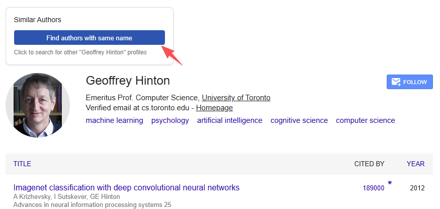
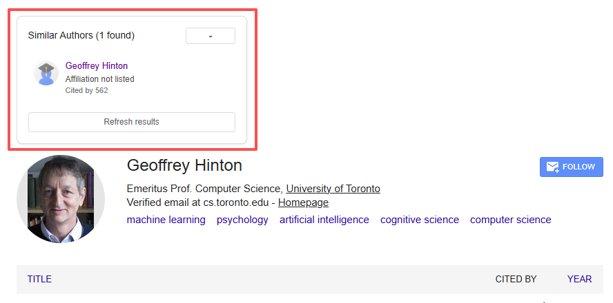

# Scholar Disambiguator

**Find the right researcher, instantly.**

A Chrome Extension that adds a "Similar Authors" disambiguation sidebar to Google Scholar profiles, helping you navigate between authors who share the same name — without the guesswork.

## The Problem

Google Scholar search results often surface the wrong author profile for common names like "John Smith" or "Wei Zhang." Finding the right researcher means manually searching and comparing multiple profiles.

## The Solution

Scholar Disambiguator brings DBLP-style author disambiguation to Google Scholar. When viewing any author's profile, one click reveals all other researchers with the same name, complete with affiliations and citation counts to help you identify the right person.

## Features

- **One-Click Search** — Find all authors sharing the same name with a single button click
- **Rich Author Cards** — View profile photos, affiliations, and citation counts at a glance
- **Direct Navigation** — Click any result to open that author's profile
- **Smart Caching** — Results are cached for 5 minutes to reduce repeated requests
- **Rate Limit Protection** — Built-in delays to avoid triggering Google Scholar's rate limits
- **Multi-Language Support** — Handles author names with non-Latin characters (Chinese, Korean, etc.)
- **Clean UI** — Matches Google Scholar's visual style seamlessly

## Installation

### From Source (Developer Mode)

1. Clone or download this repository
2. Open Chrome and navigate to `chrome://extensions`
3. Enable **Developer mode** (toggle in top-right corner)
4. Click **Load unpacked**
5. Select the repository folder

### From Chrome Web Store

*Coming soon*

## Usage

1. Navigate to any Google Scholar author profile page
2. Look for the **"Similar Authors"** panel in the sidebar
3. Click **"Find authors with same name"**
4. Browse the results and click any author to visit their profile

### Example

| Before | After |
|--------|-------|
|  |  |

## How It Works

1. **Name Extraction** — The extension reads the author's name from the current profile page
2. **Background Search** — A search request is sent to Google Scholar's author search
3. **Result Parsing** — Author cards are extracted with name, affiliation, citations, and photo
4. **Filtered Display** — The current author is filtered out, and results are displayed in a clean sidebar

## Privacy

- **No data collection** — The extension does not send any data to external servers
- **No tracking** — No analytics or user behavior tracking
- **Local only** — All processing happens in your browser
- **Minimal permissions** — Only requests access to Google Scholar domains

## Supported Domains

The extension works on all major Google Scholar regional domains:
- scholar.google.com
- scholar.google.co.uk
- scholar.google.ca
- scholar.google.de
- scholar.google.fr
- scholar.google.co.jp
- And more...

## Development

### Project Structure

```
scholar-disambiguator/
├── manifest.json          # Chrome extension manifest (V3)
├── src/
│   ├── content.js         # Content script: UI injection & DOM interaction
│   ├── background.js      # Service worker: handles fetch requests
│   └── styles.css         # Scoped styles (sd-* prefix)
├── icons/
│   ├── icon16.png
│   ├── icon48.png
│   └── icon128.png
└── README.md
```

### Building & Testing

1. Make changes to the source files
2. Go to `chrome://extensions` and click the refresh icon on the extension
3. Navigate to a Google Scholar profile to test

### Debug Logging

Open the browser console (F12) on a Scholar profile page to see content script logs, or click "Service Worker" in `chrome://extensions` to see background script logs.

## Known Limitations

- Google Scholar may rate-limit requests if used too frequently
- CAPTCHA challenges may appear after many searches — visit Google Scholar directly to resolve
- Results are limited to what Google Scholar returns (typically 10 per page)

## License

MIT License

## Acknowledgments

Inspired by [DBLP's author disambiguation](https://dblp.org/) feature.